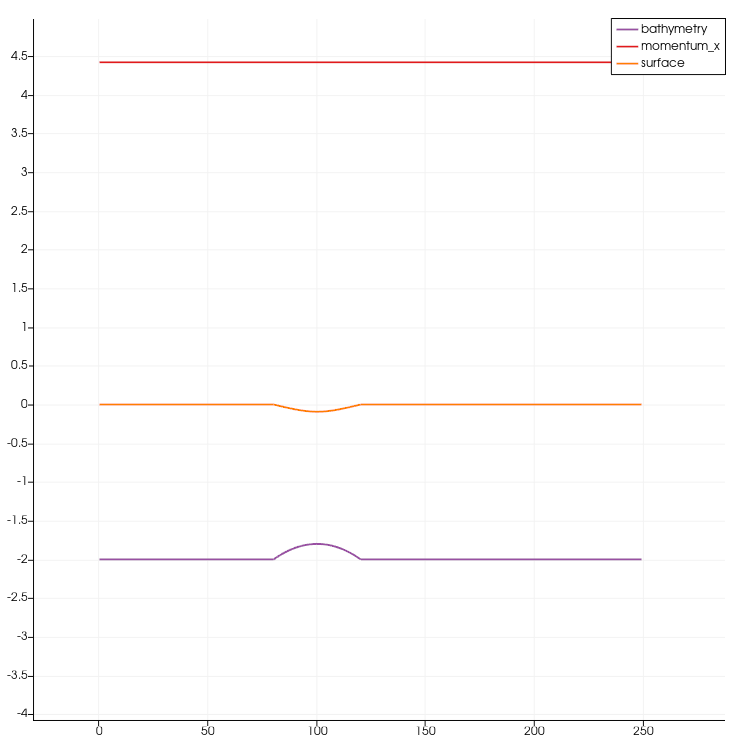
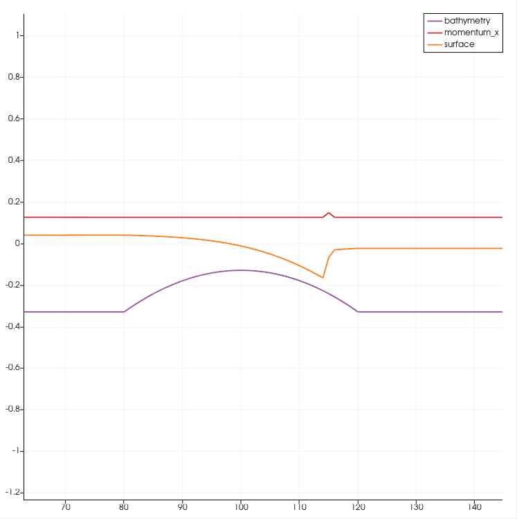

Bathymetry & Boundary Conditions
================================

Integrating of the bathymetry wasn't that easy, because the units would not have matched.
So I chose to look it up from the TUM repository `FWave.hpp <https://github.com/TUM-I5/swe_solvers/blob/master/src/solver/FWave.hpp>`_.
It is surprisingly instable, has large errors for my test scenes. These were a flat surface with rough bathymetry below.

I additionally had issues, that ParaView was not showing the files in correct order, so fixes for small bugs, that I implemented, just magically didn't work.
And that because ParaView did show an old file (e.g. file 100, shown as "0", when I wrote only the first 25 files).

Reflective Boundary Condition for wet-dry-neighbors.
----------------------------------------------------

I have shown, that my dry-wet boundary conditions are indeed reflecting like the shock-shock problem in `WavePropagation1d.test.cpp <https://github.com/AntonioNoack/tsunami_lab/blob/main/src/patches/WavePropagation1d.test.cpp>`_ in the test [WaveProp1d][Shock-Shock-By-Boundary].

Hydraulic Jumps
---------------

Now with hydraulic jumps, there were multiple simulations, so I created a static function, which handles initialization, simulation and writing to disk in one.
When choosing the resolution for the samples, 1 unit = 1 cell = 1m is pretty rough, so I chose 1 unit = 100 cells = 1m.

Both samples showed the effect that the water level is decreasing nicely. The supercritical sample additionally had a step, just like in the video.
To generate the following images, use ./build/critical1d 0/1 2700. 0 is subcritical, 1 is supercritical. 2700 is the number of timesteps.

./build/critical1d 0 2700 after it stabilized (subcritical):

./build/critical1d 1 2700 after it stabilized (supercritical):

The hydraulic jump is between 11.45 and 11.65. The small peak on the momentum graph shows that the numerical simulation still has issues.

1D Tsunami Simulation
---------------------

I have implemented the CSV loader in the existing CSV writer class. The return value is a composed data type of existing C++ structures:
a list of columns, where a column is a title and a vector of its values.

The extraction for the data using GMT, or some sample needed a few secondary packages: gmt-gshhg for the data-sets, ghostscript, and xdg-utils to open files in the preferred program. Then with the scripts from the cloud, everything worked fine.

The CSV loader then was combined into tsunami.cpp and TsunamiEvent1d, which load the data as a setup, and simulate the waves. Good values for running the simulation are 20000 computed steps, and 100 printed steps. This is equal to the command ./build/tsunami1d 20000 200 (commit 4f4f6269158fd4d7c79fac2b4850b111ae102e9e).

.. raw:: html

    <iframe width="696" height="573" src="http://www.youtube.com/embed/p8Hg5gJ3yiE?rel=0" frameborder="0" allowfullscreen></iframe>

..
    the original video can be found as w3_tsunami.mp4 in the source folder!

The video was rendered in ParaView.

The wave traveling to the right disappears, just as we expect from the outflowing boundary condition. In the deep water, the right wave becomes longer. The left side travels towards the coast, and as it does that, the wave gets smaller (length and height). Then it is reflected by our reflecting dry-wet-transition on the coast. After the reflection, the wave continues to become smaller and longer.
The wave used roughly 50 minutes to reached the coast.

