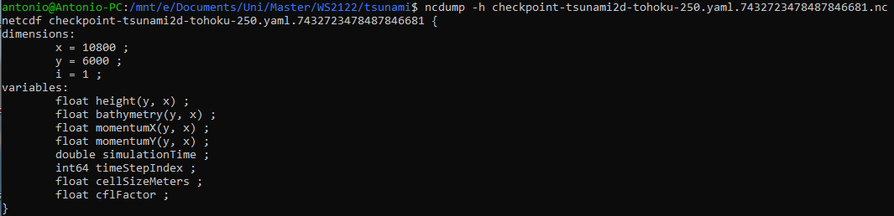
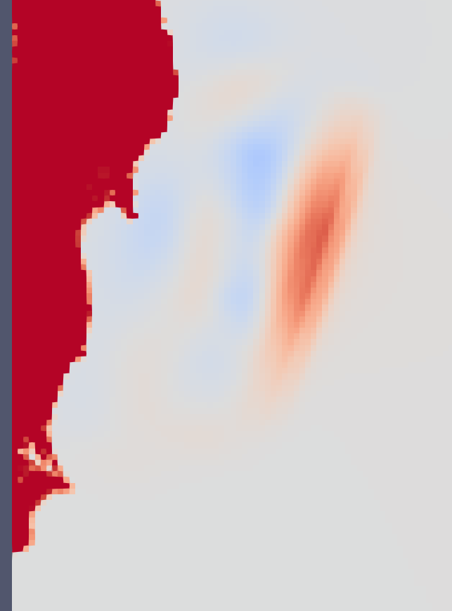
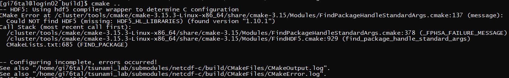
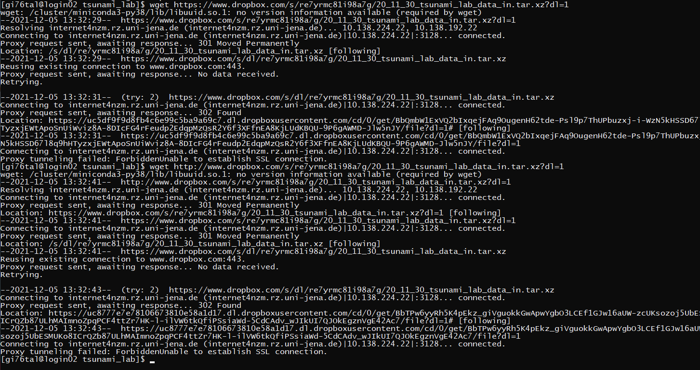
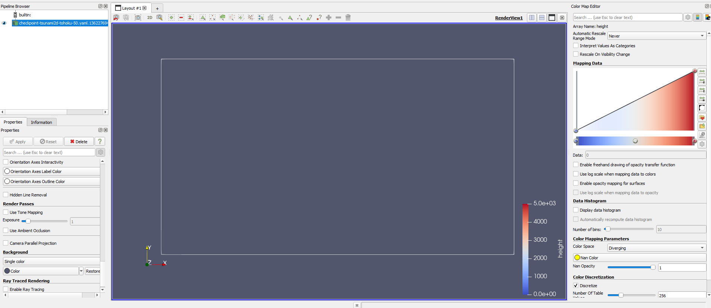
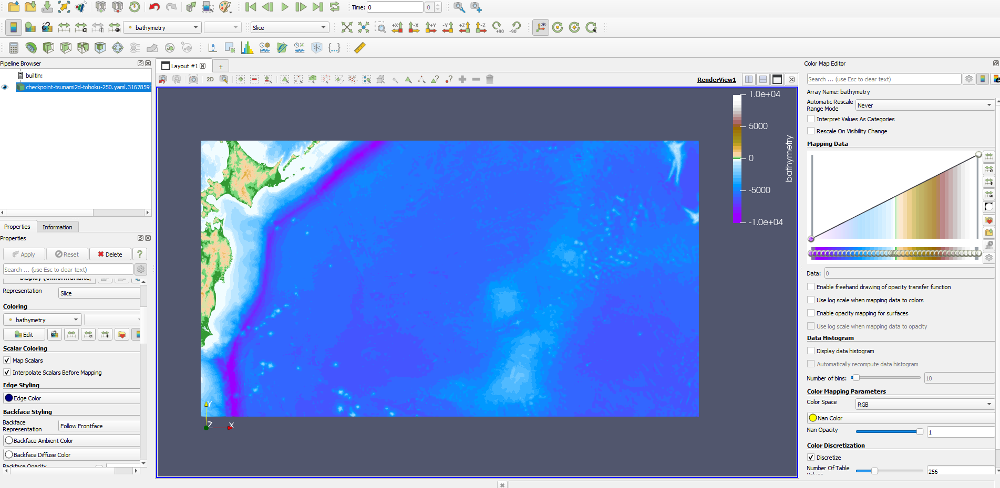

Checkpointing & Coarse Output
=============================

Checkpointing
-------------

For checkpointing, I am writing water height, momentum in x and y direction and bathymetry, as well as the cell size, time from the start of simulation, time step index and cfl factor. The displacement is not saved, because it is only needed in the setup, and to write the first frame of the result NetCDF file.

The file name is based on a hash of the config file, so when the config is changed, the checkpointing file will be changed. This behavior can be prohibited by defining checkpointFile in the config file.

Stations are serialized as well, however less proper: I found that NetCDF has compounds, which probably would be a better solution. For now, I am writing the stations as a single variable each, starting with their grid position and sampling interval, followed by all the records that they have taken until that point in time.

I also had to change the function NetCDF::appendTimeframe such that it won't write frames twice into the result file. In the screenshot below, you can see a dump of the structure of such a dump. i is the pseudo-dimension for the stations, and is empty in this case, because in that scenario, there were no stations.

Coarse Output
-------------

I had coarse output already implemented in the past, just without interpolation. Adding it was relatively simple.
The following image shows that the coarse output is working: this is from a simulation run on the 500m/cell grid with an output step size of 12, so every 12 grid cell is written (so every 144th in total). The coast line is defined just that there are no values between -20m and +20m. In the output, you can see the values clamped from -20 to +20, and the coast line is relatively smooth. Because it was interpolated.

Running the Simulation on a 50m Grid
------------------------------------

The biggest challenge was to run the simulation on a grid with 50m cell size, because of memory constraints.
The field has a size of 54000 times 30000 cells. With floats taking up 4 Bytes per value, and us needing height, bathymetry and x,y impulse data, this adds up to 25.9 GB of memory, just for these values, which are required at a minimum.

The solver also didn't just use these four arrays, but height and impulse doubled for old and new values. This brought the memory usage up to 45 GB.
Because running the program on the ARM server in the cloud is easier than running on the ARA cluster, I optimized the WavePropagation2d class, such that it no longer needs these extra values. Unfortunately with this change, updating the y-dimension now is more expensive than previously, because a) applying vector instructions is harder for the compiler, and b) we have strided memory accesses.

At the very start, I wanted to add YAML-Cpp properly by dynamically binding it, however since I have no sudo privileges on the server (because I don't have a password there), and I didn't want to disturb Alex on the weekend, I undid this changed there.

Besides that, I was worried about that server from the start, because "free -m" tells me it has 25GB of memory. This is too little for 25.9GB + map data.

Memory Efficient Writing
------------------------

I first wanted to write the checkpoints without stride, so I'd have to create a copy of the field, if I wanted to write it in a single call. I therefore implemented writing the file line by line. This unfortunately seems to be extremely slow :/. Writing the whole buffer (incorrect, because stride is different; still same amount of data) for the 50m/cell grid used approximately 5s, while as single line used 1-2s.

I found functions in NetCDF, which can write strided data, but I don't understand, what the "mapping" parameter is and NetCDF returns an out-of-bounds issue because of an out-of-bounds issue. After looking up samples on GitHub, I think "mapping" is what I'd understand as stride, and stride just needs to be an array of ones. Unfortunately, it seems to be extremely slow as well (tested it with a 250m/cell grid, and it should have finished much earlier).

Because of that, I then wrote the ghost cells to the checkpoint as well, so the library only needs a single data transfer call per variable. The ghost cells usually would be superfluous, because they just contain the values copied from the inside of the border.

Besides that, the current implementation could only write the field with 32GB of memory, it cannot load it, because I copy the data (as was suggested by us using a setup to implement checkpointing).

Trying to run on the ARA cluster
--------------------------------

I also tried to run the simulation on the ARA cluster, but unfortunately I don't have sudo privileges there either. I managed to install SCons using pip just for my user with the --user option. In the modules list, I haven't found NetCDF yet, so I might need to compile it myself.
Of course, I didn't find YAML-Cpp there either, but that isn't too bad of a problem, as I can just use the old SCons file.

When trying to compile NetCDF, the installer had the issue, that HDF5 seems like it wasn't found, even though I had loaded a HDF5 version with GCC (gcc was in the name of the module).

I found another issue, that the ARA cluster could not download the scenario (bathymetry + displacement) files from Dropbox, so I first had to download them from the FMI computers (or alternaively my own), and then moved them there. Saving the files on the FMI computer unfortunately was not possible, because there is a 4GB file limit, and my personal folder even has a limit of a single GB. I then uploaded them directly, already unzipped, from my drive to the ARA cluster home folder. So for the next lesson, they'll be available there.

Running it on my Computer
-------------------------

I wanted to run it on the ARM instance first, but found that it was really slow somehow compared to my PC, e.g. running the tests took forever.
Because the grid resolution is 5x higher than last time, and 1h was enough for maybe 2000 simulation seconds on my six core CPU, we could expect 2000/(5³) = 16 simulation seconds per hour. Even one days progress (16*24 = 384) would be pretty small.
A single step was about 0.07 simulation seconds and took about 60 real seconds to compute.

I tried to save a checkpoint (which yes indeed, would have had a size of about 29GB), but it was extremely slow. I canceled it, because the written file seemed very small, and didn't grow anymore. But then the size jumped up... is NetCDF caching the whole file? In this case, this would be a really bad idea.

Sometimes, I know I am pretty limited with my 32GB of memory, also the program just said "killed", and it just might have been killed, because it used too much memory.

Visualizing the checkpoint in ParaView wasn't easy either, because it seems like it loads the file into memory as a whole, no matter how large the file is. It could load only the layers, that it needs, or even better, render then while sweeping over the file. When the file was loaded, ParaView itself used 26GB of memory.
Also, the result didn't show up in ParaView for some reason. Just the aspect ratio of the field, and the range values (when setting the range for the color mapping) were correct.

When looking at checkpoints on the 250m/cell simulation, everything is fine. Currently I suspect there is an issue within ParaView.

Visualization of the coarse output of the 50m/cell simulation worked fine :), there just isn't anything new.