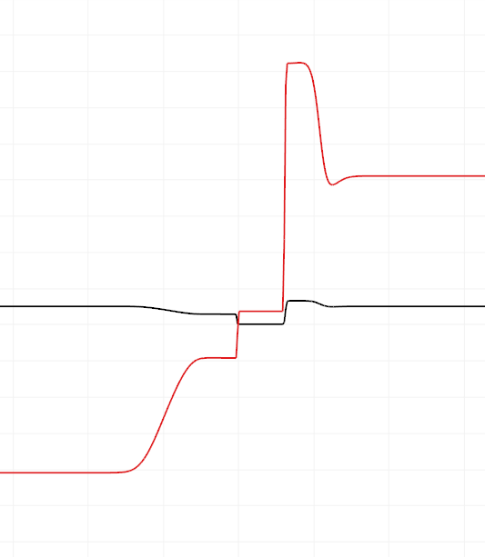
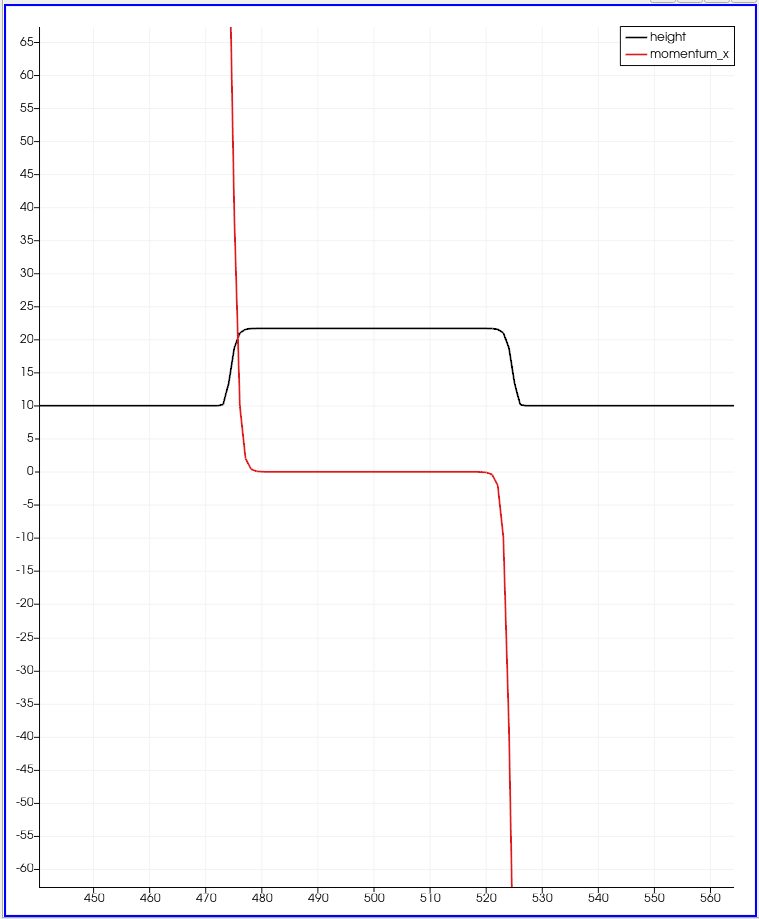
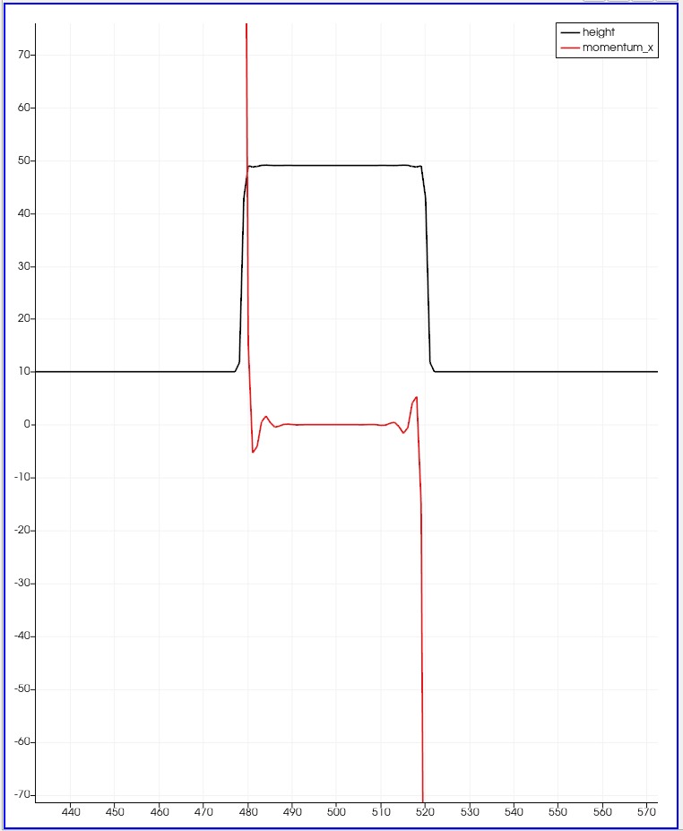

Finite Volume Discretization
============================

Switching between solvers
-------------------------

To switch between solvers, I added a member variable to WavePropagation1d, which decides, whether Roe or FWave is used as solver.

Middle States
-------------

The middle states is a huge collection of samples of analytical solutions to shallow water problems. With making the field large enough, and using enough steps, the first half (500,000) was solved. For the setup of these simulations, I created a universal Discontinuity1d-setup, which allows specifying the left and right water height, its momentum, and the split point.
Most tests in the first half also finish with just a single iteration with >= 99.9% relative accuracy.

Some tests in the second half have test cases with a water height of zero, which our solver cannot solve.
Others maybe only require much more steps or resolution.

Shock-Shock & Rare-Rare Problem
-------------------------------

For both shock-shock and rare-rare I have reused my Discontinuity1d implementation, which I have used for the middle state tests.
I implemented them as arguments for the main.cpp file. The original dam problem can be created with the Discontinuity1d setup as well.

When experimenting with the rare-rare problem, the solver currently cannot solve the problem with momentum = sqrt(height * gravity). In my sample, I used cells=1000, hL=10, hR=10. The velocity 82 was approximately the limit, the solver could handle. There already were numerical issues, but the water was indeed very shallow in the center. It was ~0.05m deep. Higher numbers produce NaNs. Without dynamic time-stepping, the solver produces water heights of less than zero.

Result from -82 +82:

When experimenting with the shock-shock problem, I first noticed no issues with speed beyond sqrt(height * gravity), however then I found issues with the momentum: it no longer was monotonous. At e.g. triple the velocity, the curves show high frequency patterns at the edges of the shock waves.

Result from +99 -99:

Result from +300 -300:

Dam Break Problem
-----------------

In a small experiment I tried to find out about the influence of river velocity on the dam problem. It seemed to have a small influence with my chosen numbers, but still: the faster the river is flowing, the smaller the shock wave is. This makes sense intuitively, because the water can be "removed" faster.

- 1000 50 10 0   0 -> ~ shock wave: 320 momentum, ~ 25 height
- 1000 50 10 0  50 -> ~ shock wave: 325 momentum, ~ 22 height
- 1000 50 10 0 100 -> ~ shock wave: 318 momentum, ~ 18 height (close to critical velocity)

When does the wave reach the village?

1000 14 3.5 0 0.7 -> shock wave with 46.6 momentum, 7.63 height,

- time step 19, time 16.0512s, shock wave is at 678m.
- time step 39, time 32.9708s, shock wave is at 866m.

Therefore the velocity of the shock wave is 11.1m/s, so the 2.5km far away village will be reached in 25000m/11.1m/s ~ 2250s = 37min 30s.
The result is a little unintuitive, as the wave velocity is only 6.1m/s.