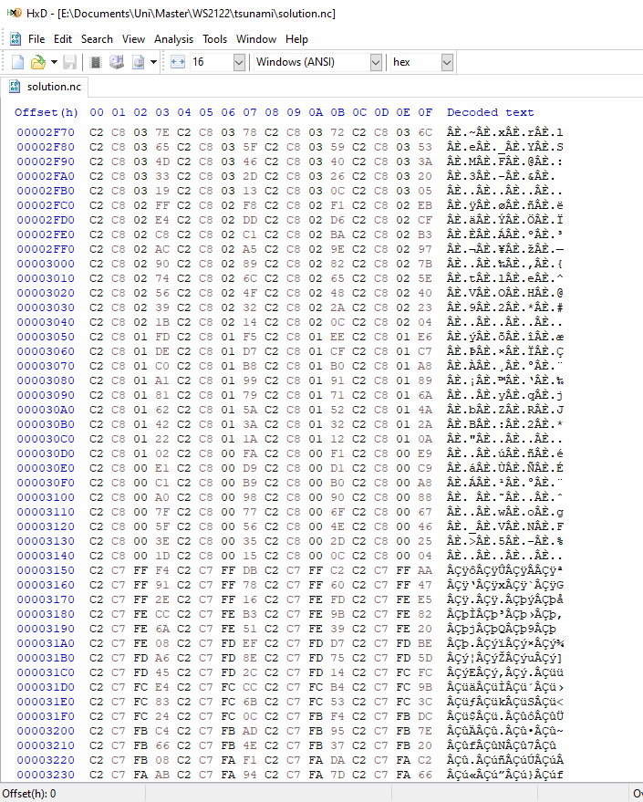

Large Data Input and Output
================================

Fixing a few issues from last week
----------------------------------

A notable issue from last week with my solution was that the circular dam was not perfectly centered. I tracked the issue down to two small issues:
- I computed the data as if it was on the cell corners, not the cell centers (+0.5 difference on both axes).
- I printed one ghost layer accidentially (+1 difference on y-axis).

Both issues are now resolved :).

Installing NetCDF & Adding it to SCons
--------------------------------------

The first step for NetCDF integration was to install NetCDF.
For that I installed the two packages "netcdf-bin" and "libnetcdf-dev".

To use NetCDF, -lnetcdf needed to be added to the CXX flags and the link flags. Additionally, I added "netcdf" to the LIBS argument of Environment.Program() calls in SCons. Then it worked.

SCons didn't need zlib or HDF5 as packages explicitely.

NetCDF interface
----------------

I had hoped there were a few more examples for NetCDF in the web, but the documentation on `unidata.ucar.edu <https://www.unidata.ucar.edu/software/netcdf/docs/>`_ was the best I've found.

With the function nc_put_vara_float() I first didn't know what the startVector was, but then understood, when the result always only contained a single time frame. It is the starting position/index for writing the data, e.g. the n-th timeframe in the (t,y,x)-grid needs the start index (n,0,0) to start writing from (y=0,x=0) in the grid. The last coordinate is the most-rapidly changing in NetCDF.

For data loading as a setup, I implemented linear interpolation, just like for the 1d CSV setup.
The setup is available as "Tsunami2d" in the main program (./build/tsunami_lab).

Checking the NetCDF loader
--------------------------

For loading, I used the sample bathymetry and displacement files as recommended.
Additionally, I used the Tohoku files from the tasks of next week.

There, the very first row contained NaNs, which were surprising at first. But we can load the data in such a way, that the first row is mapped to the ghost zone anyways.

A slight issue, that I hoped would not occur, is that the two maps for displacement and bathymetry use different resolutions. This was the case for both the sample files, and the Tohoku files (by 1 in 10000). The reader now supports this of course.

Inspecting results in ParaView & Tohoku
---------------------------------------

For fun, I then already simulated Tohoku with a scale of 1/50th for much less computational load (config/tsunami2d-tohoku.yaml).
I first was confused that the calculated result for the surface (bathymetry + water height) looked incorrect, and that it seemed to be static, even though the momentum was animated.

The issue there was that the surface in that scene is huge: there are 1700m high mountains, and the waves were just much too small for that. The visualization can be created in ParaView using the "Rescale to Custom Data Range" option in the third option bar, on the left (5th icon), and entering min = -6.3, max = +6.3.

The following videos are the surface and momentum in x-direction respectively.

..
	Die Figuren sind dazu da, dass Sphinx die Dateien kopiert, und als Link zu den Videos.
	Schöner geht es scheinbar nur über Plugins (oder wieder mit YouTube und einem iframe).
	
.. figure:: w5-tohoku-surface.mp4
	:width: 1
	
.. raw:: html

	<video style="width: 100%; height: auto" controls><source src="../_images/w5-tohoku-surface.mp4"></video>  

.. figure:: w5-tohoku-momentum-x.mp4
	:width: 1

.. raw:: html

	<video style="width: 100%; height: auto" controls><source src="../_images/w5-tohoku-momentum-x.mp4"></video>  

Running the artificial setup
----------------------------

With the artificial setup (config/artificial2d.yaml), I obtained the following simulation results for the surface (range is +5 .. -5). I used a grid size of 1000 x 1000 as in the displacement data from the sample files (total overkill in this case).

.. figure:: w5-artificial-surface.mp4
	:width: 1

.. raw:: html

	<video style="width: 100%; height: auto" controls><source src="../_images/w5-artificial-surface.mp4"></video>  

Inspecting the NetCDF file in HxD
---------------------------------

When looking at the file size, its growth seemed very linear to me, when I run the simulation. So I checked the contents, and found them to be raw, uncompressed data:

I might take a look at nc_def_var_deflate(), whether it properly compresses the data.

This topic is relevant, because our data is far from random, and therefore it can be compressed. Compressing data is not only more efficient for disks, but also faster than reading or writing huge files nowadays.

The artificial setup result file currently has a size of roughly 600MB.
