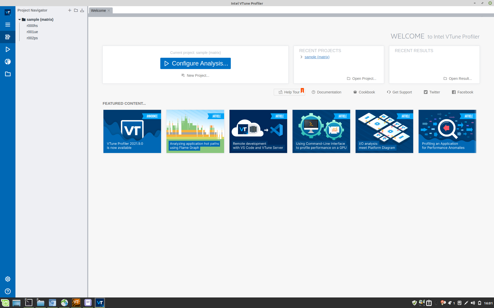

Optimization
============

Connecting to a Node
--------------------

I created a job-node with the command scalloc --partition=s_hadoop, and got assigned node 274. Unfortunately, it looks like the execution nodes don't have my favourite "console text editor" Nano installed.
Vim is installed there, so I might have to get used to it, or log in with two ssh shells.

Compiling on the ARA-cluster
----------------------------

With the installing-instructions, everything worked fine.

When compiling the tsunami simulation, the only issue was that it didn't know "pragma omp simd". I loaded the OpenMPI and GCC module for version 10.0.2.

When I then tried to run the compiled tsunami simulation, it reported that libnetcdf.so.7 was not found. With the help of `a forum post <https://code.mpimet.mpg.de/boards/2/topics/939>`_, I found that I just needed to add `LD_LIBRARY_PATH=./ara/software/lib:$LD_LIBRARY_PATH` to the environment variables, where ara/software/ is the path where I installed NetCDF, ZLib and HDF5. And then I copied `ara/software/lib/libnetcdf.so.18` to `ara/software/lib/libnetcdf.so.7`.

All existing tests passed.

Optimizations
-------------

To evaluate optimizations, I first added timers to the functions initWithSetup(), timeStep() and computeMaxTimestep()

Comparing Runtimes
------------------
12 Threads, Ryzen 5 2600, 250m/cell Tohoku: 0.33s/timestep, with VTune
0.33s without VTune as well

1 Thread, 1.74s

Installing Intel VTune
----------------------

I wanted to use VTune without the massive latency from ssh.
To install it, I followed `a tutorial to install intel-basekit <https://www.intel.com/content/www/us/en/develop/documentation/installation-guide-for-intel-oneapi-toolkits-linux/top/installation/install-using-package-managers/apt.html>`_. I added their key and then installed `intel-oneapi-vtune`, because I only wanted VTune (1.5GB), not their other stuff (15GB total). Unfortunately, the installation does not add their exectutable to the path automatically. I found the executable in `/opt/intel/oneapi/vtune/2022.0.0/bin64`.

VTune might need other packages (though they usually are installed automatically), but currently it says that it does not know my processor. It's a Ryzen 5 2600, so not a new one, just not an Intel one :/.

.. figure:: w8_vtune_unknown_cpu.png

Their constant tutorial-tries are pretty annoying.

