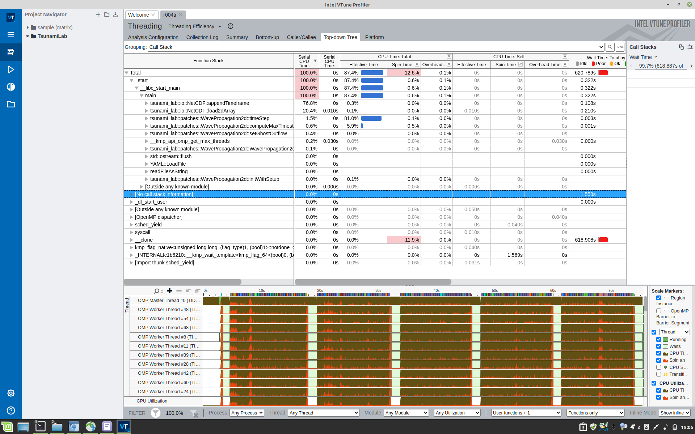

Optimization
============

Connecting to a Node
--------------------

I created a job-node with the command scalloc --partition=s_hadoop, and got assigned node 274. Unfortunately, it looks like the execution nodes don't have my favourite "console text editor" Nano installed.
Vim is installed there, so I might have to get used to it, or log in with two ssh shells.

Compiling on the ARA-cluster
----------------------------

With the installing-instructions, everything worked fine.

When compiling the tsunami simulation, the only issue was that it didn't know "pragma omp simd". I loaded the OpenMPI and GCC module for version 10.0.2.

When I then tried to run the compiled tsunami simulation, it reported that libnetcdf.so.7 was not found. With the help of `a forum post <https://code.mpimet.mpg.de/boards/2/topics/939>`_, I found that I just needed to add `LD_LIBRARY_PATH=./ara/software/lib:$LD_LIBRARY_PATH` to the environment variables, where ara/software/ is the path where I installed NetCDF, ZLib and HDF5. And then I copied `ara/software/lib/libnetcdf.so.18` to `ara/software/lib/libnetcdf.so.7`.

All existing tests passed.

Optimizations
-------------

To evaluate optimizations, I first added timers to the functions initWithSetup(), timeStep() and computeMaxTimestep(), because they are the most computational expensive.

Then I inlined the matrix multiplication, assumed the water height to be positive, and made the solver be decidable via preprocessor definition instead of a class member variable.

This brought the computation time for the 250m grid on 12 threads with my Ryzen 5 2600 from down 0.33s/timestep to 0.31s/timestep (~6% improvement).

Then I tried whether the flag `-g` has an influence on the performance, but it didn't. My idea was that the compiler might inline less functions, when this flag is enabled.

Scarce Memory Mode
------------------

The mode for when the memory is scarce iterates in the inner loop over the columns, while the data layout is row-major. This is pretty sub-optimal: for the 250m/cell grid, a single timestep needs 1.16s instead of 0.31s. The output additionally writes how much longer the y-part needed then the x-part: it's about 7.85 times slower than the iteration on the x-axis. Usually, they have the same performance. The total speedup/slow-down is roughly half of that, because the x-part uses cache-optimized accesses in both cases.

Additional slow-down comes from the slow functions to write line by line with NetCDF.

Comparing Runtimes
------------------

The sample scene is 250m/cell, Tohoku. The times is the time required for a single WavePropagation2d::timeStep() call.

| Ryzen 5 2600, 6 cores with 3.4GHz baseclock
| 12 Threads, VTune: 0.33s
| 12 Threads: 0.31s
| 6 Threads, 0.34s
| 3 Threads, 0.60s
| 1 Thread,  1.62s

| Dualsocket Xeon Gold 6140, 18 Cores with 2.3GHz baseclock, Skylake (with AVX 512)
| 72 Threads, 0.28-0.31s/timestep
| 36 Threads, 0.38-0.39s/timestep
| 18 Threads, 0.47-0.48s/timestep
| 8 Threads, 0.65-0.66s/timestep
| 4 Threads, 1.14-1.15s/timestep
| 2 Threads, 1.88-1.90s/timestep (0.97x slower for y)
| 1 Thread,  2.17-2.21s/timestep (0.92x slower for y)

Therefore, currently my six core processor is only a little slower than the 18 core skylake processor in when computing the 250m/cell grid.
Part of the difference is probably the core clock: my processor runs on 3.4GHz while the Xeon processor runs on 2.3GHz.
The Skylake node has the major advantage that it has much more memory (192GB instead of 32GB), and therefore can compute large tsunami simulations such as the 50m/cell grid with much higher speed.

GNU Compiler vs Intel Compiler
------------------------------

For the comparison between compilers, I tested on 36 Threads.
Sadly, the SCons didn't find the path to ipcp itself, so I had to use long commands.
Additionally, GCC 10.0.2 uses a confusing path: `/cluster/spack/opt/spack/linux-centos7-broadwell/gcc-8.1.0/gcc-10.2.0-ru4xdhhkxnma5i727b7njtnjoh6kff3s/bin/g++`. I compiled with -O3 and with -march=skylake-avx512.

The Intel compiler gave out the following warnings: "Inlining inhibited by limit max-size" and "Inlining inhibited by limit max-total-size".

"max" means how long the program needed to compute the maximum timestep.

| GCC 10.0.2, with AVX 512: 0.334s/timestep, 0.0082s/max
| Intel 19.1.2.254, with AVX 512: 0.312s/timestep, 0.0076s/max
| GCC 9.3.0, with AVX 512: 0.334s/timestep, 0.0082s/max

-Ofast
----------

When researching -Ofast, I found `an interesting StackOverflow article <https://stackoverflow.com/questions/45685487/what-does-clangs-ofast-option-do-in-practical-terms-especially-for-any-diffe>`_ about it.
There are flags, which disable handling of special cases like NaNs and infinities, or the sign of a zero. In our tsunami simulation, NaNs and infinities should not happen, and the sign of a zero plays no role.

Intel with AVX 512 and Ofast: 0.319s/timestep, 0.0077s/max

Installing Intel VTune
----------------------

I wanted to use VTune without the massive latency from ssh.
To install it, I followed `a tutorial to install intel-basekit <https://www.intel.com/content/www/us/en/develop/documentation/installation-guide-for-intel-oneapi-toolkits-linux/top/installation/install-using-package-managers/apt.html>`_. I added their key and then installed `intel-oneapi-vtune`, because I only wanted VTune (1.5GB), not their other stuff (15GB total). Unfortunately, the installation does not add their exectutable to the path automatically. I found the executable in `/opt/intel/oneapi/vtune/2022.0.0/bin64`.

VTune might need other packages (though they usually are installed automatically), but currently it says that it does not know my processor. It's a Ryzen 5 2600, so not a new one, just not an Intel one :/.

.. figure:: w8_vtune_cpu_unknown.png

Their tutorials for every site are pretty annoying when you first open VTune.

Is WavePropagation2d::netUpdates inlined/vectorized?
-----------------------------------------------------

WavePropagation2d::netUpdates appears normally in the Top-down Tree view, and when looking at the disassembled code of the function in VTune, it doesn't seem to be vectorized either. This is understandable, because the function has a lot of branches currently.

Propagation2d::computeMaxTimestep is a little vectorized, though not with AVX 512 as far as I can see (would be ZMM registers instead of YMM registers):

The vectorization reports say that they might be vectorized with AVX 512, when you specify "-qopt-zmm-usage=high". For the FWave-solver-call inside WavePropagation2d, it says that it has found potential dependencies, and therefore didn't vectorize it.

| "remark #15344: loop was not vectorized: vector dependence prevents vectorization. First dependence is shown below. Use level 5 report for details"
| "remark #15346: vector dependence: assumed ANTI dependence between this->m_bathymetry (134:17) and call:tsunami_lab::solvers::FWave::netUpdates(tsunami_lab::t_real (163:5)"

I added `#pragma ivdep`, which tells the Intel compiler to ignore this vector dependency, but it didn't vectorize this loop :/.

Additionally, when enabling optimization reports, the compiler somehow returned error code 1 for main.cpp. No error was specified. Without the flag, main.cpp was compiled just fine.

Using VTune on 36/72 threads
----------------------------

I then used VTune on first 36 threads, and later 72 threads. I started with 36 threads, because my application wasn't NUMA aware at that point in time (not every loop over the data was parallelized), and I feared NUMA effects.

To view the results smoothly, I first tried opening the VTune results over the sshfs-folder. This was awefully slow. After copying the data onto my PC, it was smooth and fast again :). The data recorded by VTune of these 300 simulation seconds roughly was 200MB in size.

The Hotspot view didn't help much. It showed that there was a large amount of time spent in spin-locks, but not why.

The Threading view was helpful: it showed that the main culprit of the current performance was memcpy.

After I had parallelized those sections inside WavePropagation2d::timeStep(), I got triple the performance :D. Now each timestep only used 0.128s instead of 0.31s on 36 threads.
This also meant, that there were less NUMA effects now, so I switched to 72 threads. The result scaled nicely, and the solver only used 0.067s per timestep.

Using VTune, I found out that the biggest bottleneck was memcpy inside WavePropagation2d::timeStep(). So I parallelized the copies, and the performance trippled from 0.31s to 0.128s. Additionally, to fully utilize the change, I switched to 72 threads. Now the program was able to compute a step within 0.067s.

The Bottom-Up view shows un the bottom clearly where IO (single-threaded) sections and multi-threaded sections were.

In the Top-Down-Tree you can see that most single-threaded time is taken up by the two IO operations appendTimeframe and load2dArray. Over a longer run, load2dArray's fraction would become lower. I tested on 300 simulation seconds (Tohoku, 250m/cell). Also you can see again, that the computation of the max allowed timestep takes up less than 10% of a timestep (5.9% vs 81%).

After that, I inspected the Caller/Callee view a little closer and found the main culprit of the relatively slow IO to be the NetCDF functions, not by averaging code.

Final Performance Comparison
----------------------------

With these changes, my Ryzen 5 2600 still needs about 0.31s/timestep, so now the Xeon processors are about 4.6x faster with 6x more cores.

