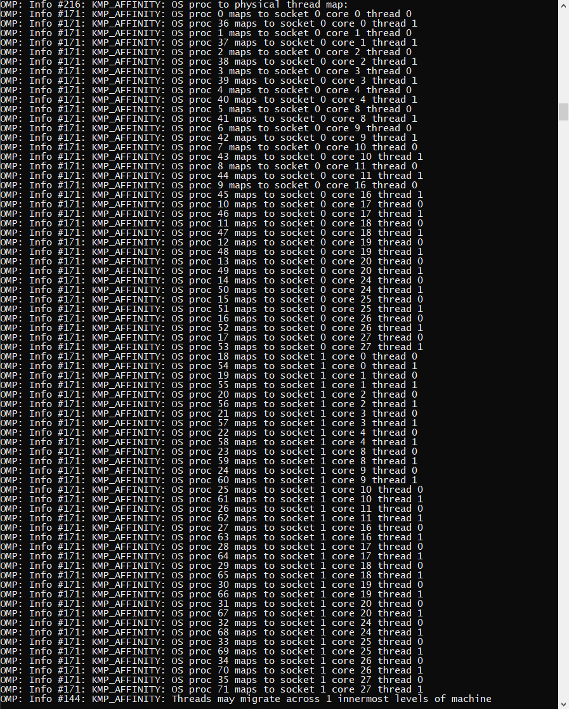
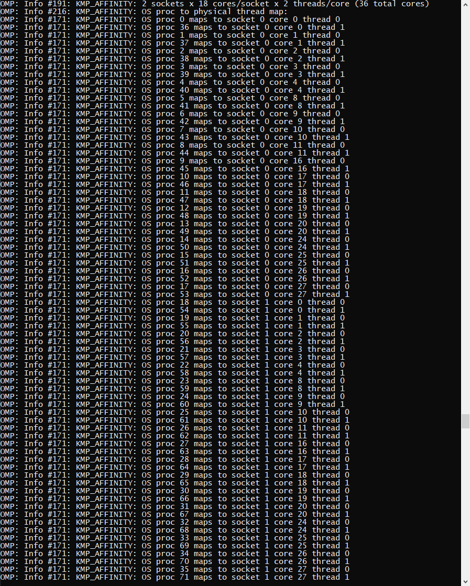

Parallelization
===============

All tests were run with the compiler flags of `AVX512=1 CXX=/cluster/intel/parallel_studio_xe_2020.2.108/compilers_and_libraries_2020/linux/bin/intel64/icpc scons`, and used the config of the setup with 250m/cell of the Tohoku event.

Runtimes and Speedups
---------------------

For the runtimes, I averaged over a few timesteps.

.. list-table:: Speedups
  :widths: 25 25 50
  :header-rows: 1
  
  * - OpenMP Threads
    - Runtime/Timestep
    - Speedup
  * - 1
    - 1.683s
    - 1
  * - 2
    - 1.455s
    - 1.157
  * - 4
    - 0.730s
    - 2.305
  * - 8
    - 0.400s
    - 4.208
  * - 16
    - 0.205s
    - 8.210
  * - 18
    - 0.167s
    - 10.08
  * - 36
    - 0.119s
    - 14.14
  * - 72
    - 0.063s
    - 26.71

Spawning more threads than cores can be useful, when the processor supports
Hyperthreading and there is pauses, in which a second thread per core could work.

That hyperthreading brings so much could mean that the CPU is waiting a lot for memory. It might be from the halfstep in y-direction, which has a lot of strided memory access.

Inner VS Outer Loop
-------------------

Starting and stopping (or synchronizing) threads introduces overhead, so it's best to keep this overhead small by maximizing the size of the individual pieces of work.

Parallelizing the inner loop would mean a synchronization for every row in every solver-step.
When the outer loop is used, only a single synchronization is required at the start & end of the parallel block.

When I change the configuration above with 72 threads, such that inner loops are parallelized, I got ~0.211s/timestep, so it is 3.3x slower than when I parallelize the outer loops. I put the changed file in `src/patches/WavePropagation2d-inner.cpp`.

If I wanted to parallize the inner loop for the sparse-memory-optimization, it would be quite a bit more complicated than it is currently.
It should be noted, that I also changed the parallization of the setup, so I get the same NUMA effects as previously.

NUMA-Effects
------------

To test the effect of the first touch policy, I removed the parallelization of the initialization,
and measured the runs. Theoretically, the processor of the first thread should have allocated all memory,
and the second one would need to request the memory from the first processor for all computations.

As the result, I got 0.0613s per timestep, so it is marginally better (~4%, probably within margin of error). It is unexpected, that it hasn't become worse.
In both cases, the first timesteps were outliers with a duration of 0.09-0.11s/timestep.
In the case with parallel initialization, it was the 1st and 3rd timestep. With the serial initialization, it
was the first 19 timesteps (of ~800 in total). It might be just random.

Pinning
-------

First, KMP_AFFINITY=verbose,compact was tested. The performance was approx. the same as previously with 0.061s/timestep.
IntelOMP reported that it placed Threads 0-17 on socket 0, thread 0, then 18-35 on socket 1, thread 0,
36-53 on socket 0, thread 1 and the rest on socket 1, thread 1. This is a bit unexpected.
Additionally, the cores were called "0"-"11","16"-"27", which is a little confusing.

Then scatter was tested. The performance was a little worse, approx. 0.065s/timestep.
Somehow, the mapping looks the same:

I wanted to get another thread-assignment, so I specified granularity=fine in hope it would fix it, but the runtime and placement was the same as previously.
granularity=thread didn't change anything either.

Scheduling Strategies
---------------------

Our task has very even computation requirements, so splitting the field into N horizontal stripes is ideal. This also reduces the amount of NUMA interactions between the processor: only the row in the middle needs to be regularly exchanged on a 2-socket system.

A scheduling options, which would be used, if the partial tasks had unpredictable computational workloads,
would be to use "dynamic", where each remaining task is the next thread, that finishes its previous task.
This requires the threads to use some kind of atomic variable or semaphore internally, and therefore would be expected to be slower.
I measured that it used ~8.01s per timestep, so it is even 4x slower than the single threaded case, and this with 36 CPU cores.

Another scheduling option is "blocks", where each thread gets assigned groups of <block-size> tasks. The blocks are assigned in round-robin fashion, so block i is assigned to thread i % <number-of-threads>.

First I tested <block-size> = 1, which means that each row is computed by a separate thread. I expected it to be a bit slower than the default distribution in <number-of-threads> blocks. A timestep used approx. 0.35s, so it is roughly 6x then the default mode.

There are 5998 rows plus ghost cells being simulated, so in the default mode, <block-size> is about 83. So I tested another value in-between: 8.
A timestep used about 0.144s, so still 2.2x slower than the default.

For curiosity, whether my assumption about the default state is correct, I tested <block-size> = 84. I used 84 instead of 83 to prevent that the first thread gets additional work from the very end.
I got 0.086s as my result, because I forgot to adjust the parallel copy-loops. They have a default block-size of ~16k*84.
Then the results were nearly what I expected: 0.070s per timestep. I might have forgotten to adjust a loop, or am slightly off.
