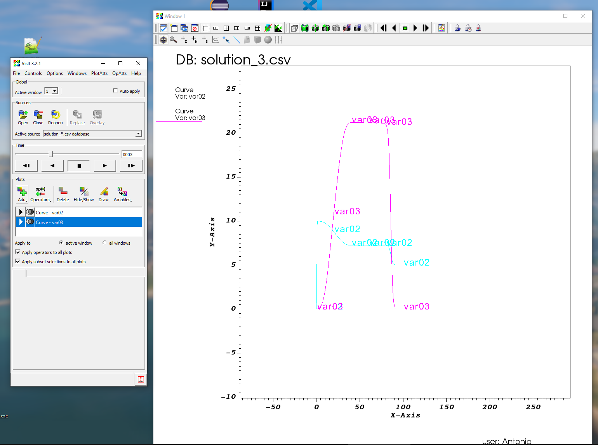
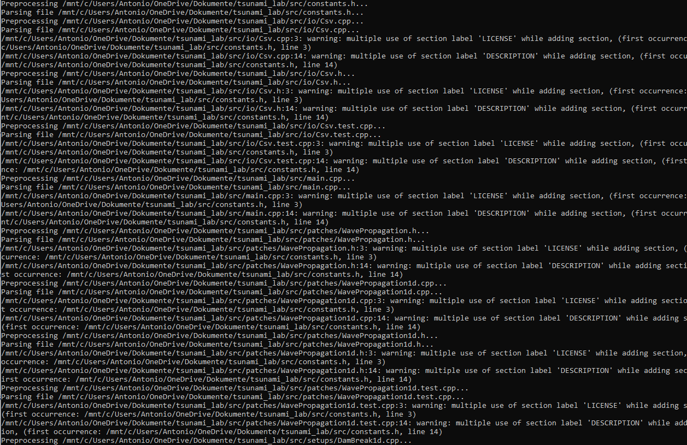

Riemann Solver
==============

Here are some of the first questions, issues and comments, I had while solving the tasks of the first week.

Issues / Questions
------------------

Does VisIt have anti-aliasing? Additionally, the titles on the curves are pretty distracting.

Doxygen: has issues with included .h-files: thinks that their description & license is relevant, and then warns about multiple occurrences.

Sphinx expects "index.rst", while Github expects "README.rst"/"README.md". Combine them elegantly somehow?

Worked fine
-----------

Doxygen documentation

Sphinx documentation

Writing the implementation, and writing tests

I first had issues to find the correct options in ParaView, but then got it working :).

.. figure:: w1_paraview.png

Positives
---------

Build speed using SCons
