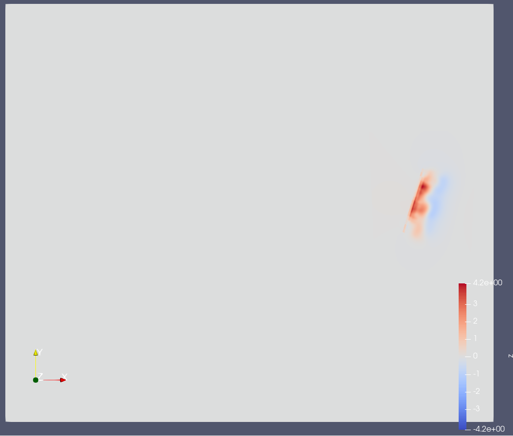
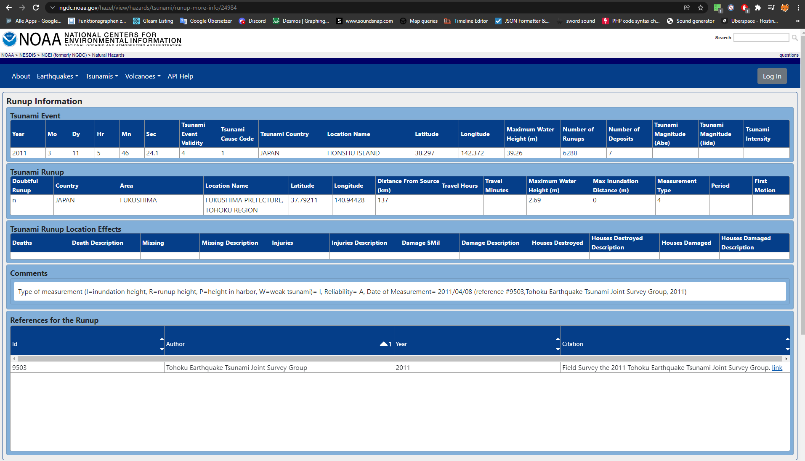

Tsunami Simulations
===================

Testing compression
-------------------

The first thing I did, was to test the compression features of NetCDF. I had to set the flag NC_NETCDF4 when opening the file, because compression is supported since version 4, then I set `nc_def_var_deflate(l_handle, l_variableId, l_doShuffle, l_doDeflate, i_deflateLevel)` for each variable. For my Tohoku config from last week, this reduced the file size from 20MB down to 15MB. It was less than I expected, but still an improvement :).

To test the different parameters, I added the field outputCompression, which is equivalent to the deflate level. 0 means no compression/fastest, 9 is the best compression and slowest. The default value is 5 for a good trade-off between size and performance.

Speedup with OpenMP
-------------------

My past computations with a grid of 1000 x 1000 cells already took quite a while, so I added "#omp parallel for" in front of the most important loops to use the 6 cores / 12 threads of my Ryzen 5 2600. I added the flag "openmp" tp SCons, how many threads are used to the runtime statistics/overview.
When running the simulation, my CPU utilisation has grown to 95%, which suggests that I have parallelized the most important functions.

Just like from past experiments in other modules, the speedup was roughly 8x in the best case (because of multithreading).

Chilean Event
-------------

Here are the two visualizations from the Chilean earthquake, bathymetry and displacement:

.. figure:: w6_chile_bath.png

A slight issue is visible, when looking closer into the displacement data: the displacement is only properly defined in the projected rectangle, not outside. Therefore, on its border, there is a small step in the water height, which will cause small tsunamis on its own. This issue might be preventable by introducing a falloff around the projected rectangle.

To further illustrate the issue, here is a frame from the simulation with a cell size of 250m at time 462s. The image shows the value of the momentum (so sqrt(momentumX²+momentumY²)).

When the grid resolution is halved, the waves can go twice as wide with each step, and there are a 4th as many grid cells, so the simulation runs 8x faster. In the Chile simulation, the Ryzen 5 2600 could compute roughly 3 timesteps per second on the 500m grid, while it could compute roughly 12 timesteps on the 1km grid.

The waves reached the border of the domain first after roughly 5450 seconds:

In the following table is an overview of the dimensions and required cell updated for the simulations. For the timesteps, I used the timesteps, which were computed in the first second (first line of reported progress). For the total number of required steps, I extrapolated the timesteps (I simulated earlier, but didn't keep the number of timesteps for all samples) to 5450s.

The total cell update count is NumberOfCells * TotalTimesteps * 2 (one for each axis).

+-----------+-------------+-------------+-----------------+----------+-----------------+--------------------+
| Cell Size | Num Cells X | Num Cells Y | Num Cells Total | Timestep | Total Timesteps | Total Cell Updates |
+===========+=============+=============+=================+==========+=================+====================+
|     250 m |   14000     | 12000       | 168.0 M         | 0.39 s   | 13974           |      2348 B        |
+-----------+-------------+-------------+-----------------+----------+-----------------+--------------------+
|     500 m |    7000     |  6000       |  42.0 M         | 0.79 s   |  6899           |       290 B        |
+-----------+-------------+-------------+-----------------+----------+-----------------+--------------------+
|    1000 m |    3500     |  3000       |  10.5 M         | 1.58 s   |  3449           |        36 B        |
+-----------+-------------+-------------+-----------------+----------+-----------------+--------------------+

M = 1e6, B = 1e9.

In the following video, you can see the Chile simulation on a grid with cell size of 1km.

.. figure:: w6-chile-1k.mp4
	:width: 1

.. raw:: html

	<video style="width: 100%; height: auto" controls><source src="../_images/w6-chile-1k.mp4"></video>  

Tohoku Event
------------

The setup contains the following bathymetry and displacement data:

From a simulation with a cell size of 1km (config/tsunami2d-tohoku-1k.yaml), after roughly 1900s (32min), the tsunami reached the border of the computational domain. The hit is on the left side, in the lowest quarter.
For the following table, the time is extrapolated again, because I didn't keep the total timesteps for all runs.

+-----------+-------------+-------------+-----------------+----------+-----------------+--------------------+
| Cell Size | Num Cells X | Num Cells Y | Num Cells Total | Timestep | Total Timesteps | Total Cell Updates |
+===========+=============+=============+=================+==========+=================+====================+
|     250 m |   10800     |  6000       |  64.80 M        | 0.35 s   |  5429           |      351.8 B       |
+-----------+-------------+-------------+-----------------+----------+-----------------+--------------------+
|     500 m |    5400     |  3000       |  16.20 M        | 0.71 s   |  2676           |       43.4 B       |
+-----------+-------------+-------------+-----------------+----------+-----------------+--------------------+
|    1000 m |    2700     |  1500       |   4.05 M        | 1.42 s   |  1338           |        5.4 B       |
+-----------+-------------+-------------+-----------------+----------+-----------------+--------------------+

I limited the momentum domain on the x-axis in this visualization from [-500,+500] to [-100,+100] to make the wave better visible.
The screen shot was taken from the 1346th timestep, so on average, each timestep had a length of 0.7 simulation seconds.
With a cell size of 1km, the region had 2700 x 1500 cells. So the total simulation cost until that point is roughly 11 billion cell updates (2700*1500*1350*2/timestep).

When simulating the Tohoku event with a cell size of 250m, I also encountered that the timesteps suddenly, for some steps, were much smaller. I believe that there was a small spike or something like this somewhere on the map. Usually, a simulated second took roughly three seconds to compute.

Here is the simulation on a grid of 250m for the first hour after the earthquake:

.. figure:: w6-tohoku-250m.mp4
	:width: 1

.. raw:: html

	<video style="width: 100%; height: auto" controls><source src="../_images/w6-tohoku-250m.mp4"></video>  

Data about Sõma 
---------------

It was difficult to find appropriate data on `ngdc.noaa.gov <https://www.ngdc.noaa.gov/>`_. On the `map <w6_tohoku_soma_city.png>`_, there was data such as the death toll, but unfortunately, there was no accurate time or height data.

In the `run-up database <https://www.ngdc.noaa.gov/hazel/view/hazards/tsunami/related-runups/5413>`_, I found `an entry, which has the coordinates of the city <https://www.ngdc.noaa.gov/hazel/view/hazards/tsunami/runup-more-info/24984>`_. However, I am unsure about this measurement, because in the section for comments, there is a totally incorrect date for the date of measurement.
There is similar entries with up to `21m water height <https://www.ngdc.noaa.gov/hazel/view/hazards/tsunami/runup-more-info/24024>`_.

Arrival Time Approximation
--------------------------

The distance from the city to the epicenter is roughly 137km (via dataset entries). In the CSV file, the coast is at (-125000,-53000) and the epicenter is at (0,0). This projected data would give us a distance of ca. 136km. The depth at the epicenter is roughly 970m, and it quickly becomes shallower towards the coast, so let's assume 300m water height. The wave speed would be roughly 54m/s. Therefore, the wave would arrive at Sõma roughly 2540s (42min) after the earthquake.

In the simulation, I introduced grid coordinates for stations, which are then taken as coordinates in the input grid (can start at any coordinate) instead of the simulation grid (always starting from (0,0)).

When looking at the results, I first was surprised to see changes to the height from the very start, but upon further inspection, I found that the displacement has non-zero values at Sõma:

Then, looking height and momentum over time in ParaView, we see that the water height first decreases by nearly two meters (10%), and starting at 2600s (43min) after the earthquake, the water starts to rise again. The estimate was this accurate to a minute just by luck, but what is important is that it roughly matches. At 3200s (53min) after the earthquake, the water is higher than the initial water height of 20m.

