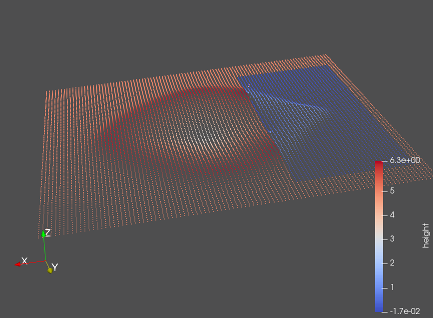
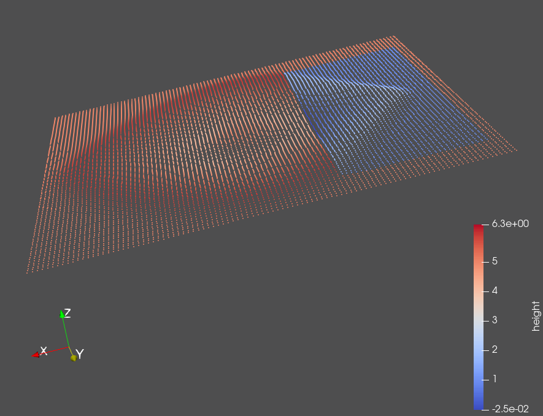

Two-Dimensional Solver & Stations
=================================

First I added the two dimensionality. I also split the apply-flux-part into a separate function, because it's needed twice now.

As recommended, I then replaced my three main() functions by a single one, which loads the runtime configuration from a YAML-like file format.
Currently, I've implemented the reader myself, because often it's easier than to learn a new library. It comes with the limitation that the current format ignores indentation.

Because of that, stations currently are specified in a CSV file, and names are limited to numeric values (because of the existing CSV reading method).

Still, this is a nice improvement, because testing and reproducibility has simplified :).
A slight issue is that I'm often tempted to change parameters inside a file instead of creating a copy of that file. This nullifies the reproducibility-advantage.

For usability, I added an additional time limit. The defaults for both are infinity (or int::max), so the user can decide whether he wants a timestep limit or a time limit.
Printing results as CSV now happens at regular simulation time intervals instead of regular step intervals.

The 2d tsunami-simulations can be visualized in ParaView using the action "Table to points" (Extractors/Search.../Enter "table to points"). You need to have your dataset selected to apply it. You then have to make it visible and define the x,y,z components of these points. Then apply the changes.
You can add a second layer by applying this action again on the original source, and by changing the z-component.
However, multiple layers often are hard to separate, so it's not that useful.

I like that it is possible, but I don't like the Arcball controls (rotation matrices are accumulated). I'd much rather have Orbit controls (pitch & yaw are accumulated). I haven't found a way to change it. (Why do people need the "roll" axis anyways?)

Obstacle in 2d fluid simulation
-------------------------------

First I experimented with an obstacle, which was dry. It reflected the incoming wave as expected. The config for that example is config/dambreak2d5050obstacleDry.yaml.
In the following images, the rendered height is the surface, the color is the water depth. The shallow section is blue, and the rest is orange-ish.

.. figure:: w4_obstacle_reflection2.png

When I tried to experiment with the wave flowing over a very shallow piece of land, the solver had issues (kind of as expected), and the timesteps were really small, so it needed a long time to solve it. The higher the water, the easier and faster it was solvable. With a height of 10cm on top of the obstacle, I even got a NaN in the result. I tracked it down, and found that the issue was in the FWave solver when combining the waves: it was beyond super-sonic speeds, and both waves had a computed height/impulse update of +/-Infinity. Adding +Infinity and -Infinity resulted in NaN as output.
Increasing the precision to double wasn't enough, so I wrote as a "fix", that every update, which results in NaN, is reset to the original value (time stops).
The config for this test can be found in config/dambreak2d5050obstacleShallowCritical.yaml.

When looking at the result of this test, you see a few peaks (orange color) in the blue section. These high peaks were obtained with 100k steps instead of 10k in the file. 100k steps currently take quite a while to process.

When a less extreme shallowness is used, the water behaves properly. Interesting is the triangular wave form on the shallow section.

Stations
========

